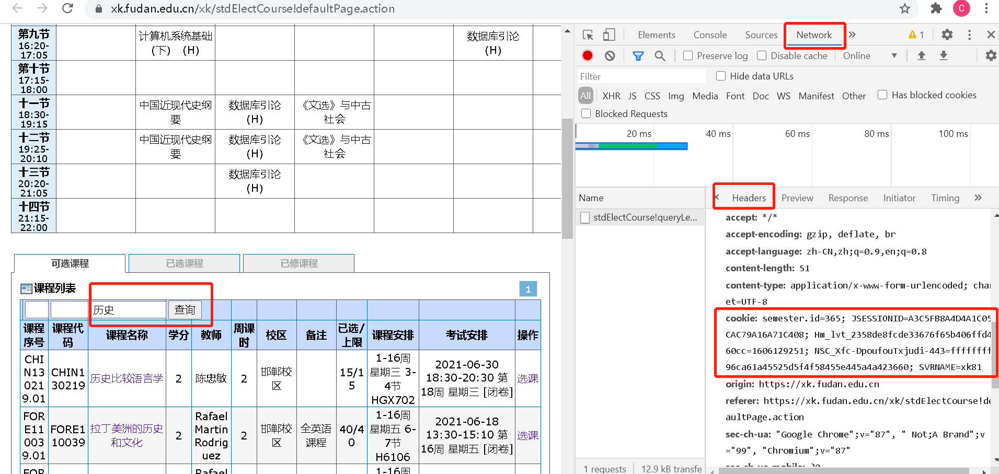
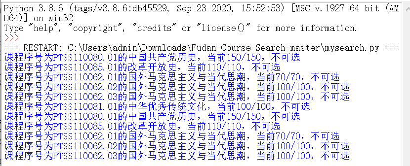

### 复旦本科生刷课脚本

本脚本改写自https://github.com/ICYPOLE/Fudan-Course-Search [复旦研究生课程刷课、捡漏脚本]  by [ICYPOLE](https://github.com/ICYPOLE)

作者：[Calvin](https://github.com/Unparalleled-Calvin/) 、 [Xavier](https://github.com/ZiYang-xie)

### 使用方法

将要蹲的**课程序号**，即选课查询表单的第一栏，按行写入lessons.txt

登录选课系统，提交一次请求，从浏览器network栏获得cookie，**将cookie拷贝到cookies.txt文件中**

在http://www.ttshitu.com/  **注册账号**，充值一定的金额用于图片识别(最少一元，够了，一次识别只需要0.002元)，**将用户名，密码写入info.txt的1,2行中**，info.txt为空将无法实现抢课功能

cookie获得方式如图

执行py文件，会不断对考察列表轮询，查看当前课程是否已选满。如果未选满，则会读取验证码，并进行选课尝试，效果如下所示。图片识别可能出错，需要等待下一次轮询。

### 使用注意

1. 本脚本采用python编写，需要安装python。(可以自行打包成exe)

2. 由于脚本采用cookie进行发包，每次登陆选课系统cookie都不相同，使用脚本过程中不应在其他设备用同一账号登陆选课系统。

3. 验证码需要**利用外部接口进行远程识别**，每次识别需要在接口网站花0.002元，实际上选课系统第一次选课是不会弹出验证码的，如果没有账号，该脚本对您起不到**帮助抢课**的作用。

4. 本脚本还处于测试阶段，如果出现bug，欢迎指出
